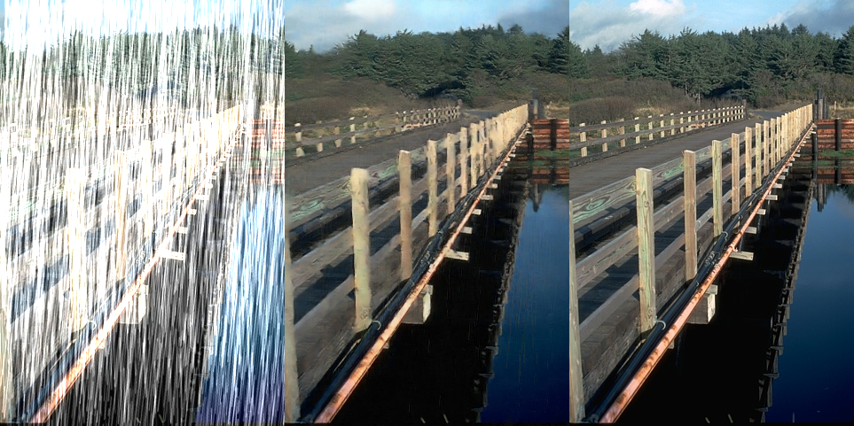

## Non-locally Enhanced Encoder-Decoder Network for Single Image De-raining
The testing code of [**Non-locally Enhanced Encoder-Decoder Network for Single Image De-raining**](https://arxiv.org/abs/1808.01491).

### Visualization


### Environment
- python 3.6
- pytorch 0.4.0

### Download Link [(here)](https://pan.baidu.com/s/1ulL7fBLDWhgfDjvZL_IDWg#list/path=%2F)
- Four testing sets.
- De-rained results.
- Four model weights.

### Running Steps
1. Download four testing sets (Rain100L, Rain100H, DDN, DID-MDN).
2. Choose the type of dataset in **config.py**.
    ```
    data_type_list = ['Rain100L', 'Rain100H', 'DDN', 'DID']
    data_type = data_type_list[2]
    ```
3. Run **test.py**.
    ```
    python test.py
    ```
### Cite Information
    @article{li2018non-locally,
    title={Non-locally Enhanced Encoder-Decoder Network for Single Image De-raining},
    author={Li, Guanbin and He, Xiang and Zhang, Wei and Chang, Huiyou and Dong, Le and Lin, Liang},
    journal={acm multimedia},
    year={2018}}
